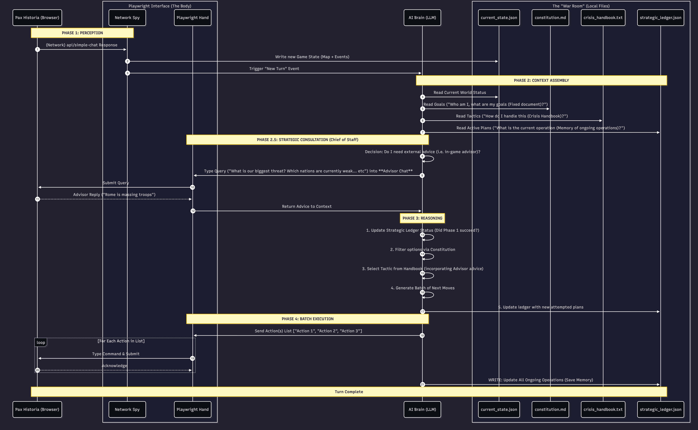

# Pax-Automata

A minimal autonomous agent that plays [Pax Historia](https://www.paxhistoria.co)—a browser-based, AI-powered grand strategy game where you lead a nation through alternate history.

The agent runs a **cognitive loop**: perceive the world, consult memory and goals, reason with an LLM, then execute actions in the game. Pax-Automata is built to show how a small, file-based “war room” and strict boundaries between perception, memory, and action can yield a debuggable, transparent autonomous player—without black-box state or brittle screen scraping.

---

## **Quick Start: Configure & Play**

**All you need to do is modify three things:**

1. **Game scenario preset** — Choose which historical scenario to play
2. **The country** — Select which nation the agent will control
3. **The constitution** (`war-room/constitution.md`) — Define the agent's goals and strategic identity

**The agent will take care of the rest!** It will automatically perceive the game state, reason about actions, execute moves, and advance through turns—running the full cognitive loop autonomously.

---

## Table of Contents

- [Getting Started](#getting-started)
- [Overview](#overview)
- [Architecture](#architecture)
- [Building Blocks](#building-blocks)
  - [Perception (Spy)](#perception-spy)
  - [War Room (Memory)](#war-room-memory)
  - [Brain (Reasoning)](#brain-reasoning)
  - [Hand (Execution)](#hand-execution)
- [War Room Files](#war-room-files)
- [The Advisor: Why We Use It (and What We’re Not Doing)](#the-advisor-why-we-use-it-and-what-were-not-doing)
- [Key Strategies & Learnings](#key-strategies--learnings)
- [Post Notes](#post-notes)
- [Example Run](#example-run)
- [Next Steps](#next-steps)
- [Tech Stack](#tech-stack)
- [Design Docs](#design-docs)

---

## Getting Started

### Installation

```bash
git clone https://github.com/phillipyan300/Pax-Automata.git
cd Pax-Automata
npm install
```

Create a `.env` with your API keys if you use the Brain (see [docs/auth-setup.md](docs/auth-setup.md) for auth and env).

### Run the full cognitive loop

```bash
# One-time: capture browser auth (manual Google login)
npm run capture-auth

# Start the agent (loop: advisor → spy → brain → hand → next turn)
npm start
```

Optional: `GAME_URL=https://www.paxhistoria.co/game/your-game-id npm start` to skip the preset flow and go straight to an in-progress game. The agent works for **any country and any game preset**—just change the initial navigation (e.g. which preset or game you open) to point at the nation and scenario you want.

In the loop, type **`ready`** (or **`r`**) to advance one week and continue; **`quit`** (or **`q`**) to exit; **Enter** alone to re-run advisor + Brain on the same turn (e.g. re-roll actions). Feel free to play around with the **constitution** (`war-room/constitution.md`) to change the agent’s goals and identity; the Brain reads it every turn.

### Manual / test session (interactor)

For a single browser session—login, navigate, test action/advisor boxes, run Spy once—use the interactor:

```bash
npm run capture-auth
npm run interactor
```

- Open a specific game: `GAME_URL=https://www.paxhistoria.co/game/your-game-id npm run interactor`
- Run one action + one advisor query and write state: `TEST_ENTRY=1 npm run interactor`. Then type **`ready`** and Enter to advance one week and dismiss event popups.

See [docs/auth-setup.md](docs/auth-setup.md) for auth and [src/interactor.ts](src/interactor.ts) for the script.

### Standalone Brain (no browser)

To test context assembly and LLM action generation without the game:

```bash
npm run brain
```

Reads all War Room files and `current_state.json`, calls Gemini, validates the response, updates the ledger, and prints the action batch.

---

## Overview

### Why a cognitive loop?

Pax Historia is a decisional pause game: time stops while you choose actions, then you jump forward and the world evolves. An agent must (1) see the current world, (2) remember its goals and ongoing plans, (3) decide what to do this turn, and (4) type those actions into the UI. That’s exactly one iteration of a **perceive → remember → reason → act** loop.

Putting each step behind a clear boundary (Spy writes files; Brain reads files and calls the LLM; Hand reads an action list and drives the UI) keeps the system understandable. You can inspect `current_state.json`, `strategic_ledger.json`, and the Brain’s prompt without opening the game. You can re-run the Brain with the same state, or change the constitution and see how behavior shifts. The loop is the minimal structure that makes that possible.

### Why not just “scrape the screen”?

Vision-based agents are possible but brittle: UI changes break selectors and layout. Pax Historia exposes game state over the network when you talk to the in-game advisor. By **intercepting** the `/api/simple-chat` request body, the Spy gets the same structured text the game’s own AI sees—map, battalions, events, diplomacy—without parsing the DOM. Perception becomes “what the game sends,” not “what we can scrape.” That’s the main strategic choice behind the Spy.

### The advisor: why we use it (and what we’re not doing)

**We are not “ask the advisor and do what it says.”** The advisor is in the loop for two reasons:

1. **The advisor request payload *is* the game state.** When you submit a message to “Ask your advisor…”, the game sends a POST to `/api/simple-chat` whose body contains the *entire* current world (map, battalions, events, diplomacy). We intercept that request to get our perception—we don’t get that payload from anywhere else. So we *have* to trigger an advisor call each turn to receive the state. The advisor’s *reply* is a useful extra (we store it and feed it to the Brain), but the primary reason we hit the advisor is to obtain the **request** payload.
2. **We can ask specific questions.** The query we send (e.g. “What is our current position and what do you advise?” or a dynamic `next_advisor_query` from the Brain) lets us gather targeted intel or suggestions. That’s one input among many.

**Overall strategy comes from the whole War Room:** constitution (goals and identity), crisis handbook (tactics and doctrines), and strategic ledger (multi-phase operations). The Brain combines *all* of that with the current state and the advisor’s answer, then decides actions. The advisor does not drive the plan—it’s one necessary channel for state and one optional source of advice.

### Architecture at a glance

```
Browser (Pax Historia)
    ↕ network intercept (on advisor submit)
Spy → current_state.json, advisor_response.txt, ownership_snapshot.json
        ↓
Brain ← constitution.md, crisis_handbook.txt, strategic_ledger.json
        ↓
Brain → Gemini 2.5 Flash → ActionBatch (Zod-validated)
        ↓
Hand → type actions, submit advisor query, advance turn, dismiss popups
```



*Full sequence (source): [war-room-flow.mmd](docs/diagrams/war-room-flow.mmd) (Mermaid) | [war-room-flow.png](docs/diagrams/war-room-flow.png) (PNG).*

---

## Architecture

The agent is four modules and a file-based War Room:

| Module | Role |
|--------|------|
| **Spy** | Intercept `/api/simple-chat` when the advisor is queried; write game state and advisor response (and optional ownership snapshot) to `war-room/`. |
| **War Room** | Local files: constitution (goals), handbook (tactics), ledger (active operations), current state, advisor response. No database—just JSON and text. |
| **Brain** | Assemble context from all War Room files → build system + user prompt → call Gemini → Zod-validate ActionBatch → merge ledger updates → return actions. |
| **Hand** | Playwright UI driver: action box, advisor box, next-turn button, “Next Event” / “Proceed” flow, optional popup watcher. |

Data flows in one direction per turn: Spy writes; Brain reads and writes ledger; Hand reads action list. No shared in-process state between modules—they meet at the filesystem and the orchestrator in `src/index.ts`.

---

## Building Blocks

### Perception (Spy)

The Spy does not scrape the page. It uses Playwright to **wait for the next request** to `/api/simple-chat` (triggered when the user—or the agent—submits a message in the “Ask your advisor…” box). The request body is JSON: it contains a long `prompt` string that includes (1) the game’s system prompt for the advisor, (2) the actual game state (map, USA status, events, diplomacy), and (3) instructions like “Remember, it is crucially important that you guide the player…”.

**Key decision: strip advisor-only content.** The Brain must reason over *game state* only. If we feed it the advisor’s system prompt and “guide the player” tail, the LLM can get confused (e.g. think it *is* the advisor). So the state-writer finds the sentinel `*** Description of the Map in the CURRENT Round: ***` and keeps everything from there until the “Remember, it is crucially important…” line. What’s written to `current_state.json` is only the middle slice: map, battalions, events, diplomacy. Same data the game uses to answer the advisor—just without the wrapper text.

**Ownership snapshot.** The game state text includes sections like “Status of the USA” and “All Regions Owned by the USA.” The Spy (via `ownership-parser`) can parse those into a small JSON file: `our_nation`, `regions_we_own[]`. The Brain uses this so the model has an explicit list of what we own; “we have troops there” is not enough—only the authoritative list counts for conquest goals.

### War Room (Memory)

The War Room is **files on disk**, not a database or vector store. That’s intentional:

- **Debuggability:** You can open `strategic_ledger.json` or `constitution.md` in an editor. No need to query a DB or inspect in-memory state.
- **Version control:** Goals and playbooks can live in the repo; ledger and state are runtime outputs.
- **Composition:** The Brain is a pure function of “read these paths”; no connection strings or caches. Same context every time for the same files.

**Dual-document design.** Long-term “who we are and what we want” lives in **constitution.md** (and **crisis_handbook.txt** for tactics). Turn-by-turn “what we’re doing” lives in **strategic_ledger.json** (active operations, phases, steps). The constitution is fixed for a run; the ledger is updated by the Brain each turn (and optionally post-execution). So identity and strategy are stable; only the *plan state* changes.

### Brain (Reasoning)

The Brain’s job is: given the current world and all War Room docs, produce a **batch of actions** (strings to type into the action box) and **ledger updates** (new or updated operations).

**Context assembly.** One function reads every War Room file: `current_state.json`, `constitution.md`, `crisis_handbook.txt`, `strategic_ledger.json`, `advisor_response.txt`, and optionally `ownership_snapshot.json`. All are passed into a single system + user prompt. So the LLM always sees the same structure; the only thing that changes turn-over-turn is the content of those files.

**Forced JSON.** The LLM is called with a response schema (Gemini’s `responseSchema` / `responseMimeType: "application/json"`). The model cannot return freeform text—only a JSON object that matches `ActionBatch`: `reasoning`, `actions[]`, `ledger_updates[]`, optional `next_advisor_query`. That makes parsing and validation trivial: Zod parse, and we’re done. No regex or retry loops for “extract the JSON from the message.”

**Ledger merge.** The Brain writes **before** the Hand runs. When the LLM returns `ledger_updates`, we merge by `operation_id`: existing operations are updated in place, new ones appended. So if execution is interrupted, we’ve already persisted “what we intended.” A future step is a post-execution commit (e.g. mark phases complete after Hand finishes); that belongs in the orchestrator, not inside the Brain.

**Advisor as chief of staff.** The in-game advisor is treated as a consultant: we send a question (fixed or from the previous turn’s `next_advisor_query`), capture the reply into `advisor_response.txt`, and feed it into the Brain’s context. The constitution can say “advisor is advisory; constitution overrides.” So we get the game’s own summary and suggestions without ceding control.

### Hand (Execution)

The Hand is a thin Playwright layer: selectors for the action box, advisor box, submit, next-turn button, and event popups (“Next Event”, “Proceed &lt;date&gt;”). It does not know about the Brain or the Spy; it receives an array of action strings and a page, and it types and submits each in order (with a short delay between actions to avoid UI race conditions).

**Next-turn flow.** Advancing time is “click jump-forward → choose 1 week → dismiss every ‘Next Event’ until none → click Proceed.” The game may take a few seconds to generate the next event (it uses its own LLM). So the Hand waits with a long timeout and loops until the timeline is closed. A background popup watcher can also dismiss stray dialogs so the main flow isn’t blocked.

**Batch execution.** The orchestrator (`src/index.ts`) gets an `ActionBatch` from the Brain and calls `enterAction(page, action)` for each `batch.actions[i]`. No separate “executor” process—just a loop in the main entry point. Keeps the pipeline simple and all in one place.

---

## War Room Files

| File | Written by | Purpose |
|------|------------|---------|
| `current_state.json` | Spy | Latest game state text (map, battalions, events, diplomacy); Zod `GameStateSchema`. |
| `ownership_snapshot.json` | Spy | Parsed “what we own”: `our_nation`, `regions_we_own[]`; Zod `OwnershipSnapshotSchema`. |
| `advisor_response.txt` | Spy (after Hand submits advisor query) | Latest advisor reply; overwritten each turn. |
| `next_advisor_query.txt` | Brain | Optional; next turn’s advisor question (from LLM `next_advisor_query`). |
| `constitution.md` | Human / repo | Strategic identity and goals (fixed for a run). |
| `crisis_handbook.txt` | Human / repo | Tactical playbook and doctrines (Inspired by Model UN crisis committees). |
| `strategic_ledger.json` | Brain | Active operations (multi-phase plans); Zod `StrategicLedgerSchema`. |

All JSON boundaries are defined and validated in [src/shared/schemas.ts](src/shared/schemas.ts).

---

## Key Strategies & Learnings

1. **Intercept, don’t scrape.** Using the game’s own API for state (via the advisor request) gives a stable, structured input. No dependency on DOM layout or accessibility tree.

2. **Strip context that isn’t for the Brain.** The raw `prompt` in the request is for the in-game advisor. Slicing out the “map in current round” → “guide the player” segment keeps the Brain’s context clean and avoids role confusion.

3. **Zod at every boundary.** Every JSON file read/write and every LLM response is validated. Fail fast with clear errors instead of passing malformed data into the rest of the pipeline.

4. **File-based memory is a feature.** No DB or cache means “state” is exactly what you see in `war-room/`. Easy to reason about, easy to diff, easy to replay or tweak by editing files.

5. **Constitution vs ledger.** Separating “who we are” (constitution + handbook) from “what we’re doing” (ledger) keeps long-term goals stable while the plan evolves. The LLM can update operations and steps without rewriting the agent’s identity.

6. **Forced JSON from the LLM.** Schema-constrained output removes the need for brittle parsing and retries. The Brain always gets a structure it can validate and merge.

7. **Orchestrator owns the loop.** Spy, Brain, and Hand are stateless modules. The only place that knows “advisor → spy → brain → hand → next turn” is `src/index.ts`. That keeps the cognitive loop explicit and easy to change (e.g. add a “confirm with user” step or skip advisor on certain turns).

---

## The Advisor: Why We Use It (and What We’re Not Doing)

We are **not** “ask the advisor and execute its advice.” The advisor is in the loop because its **request** payload is the only way we get the full game state each turn; we also use it to ask specific questions. **Strategy is driven by the whole War Room** (constitution, handbook, ledger). Full explanation: [Overview → The advisor](#the-advisor-why-we-use-it-and-what-were-not-doing).

---

## Post Notes

- **MVP and moving parts.** There are a lot of moving parts (browser, intercept, War Room files, LLM, UI automation). The goal was an MVP that gives the info needed to act. The main realization: **the state is a gold mine.** Once we had the advisor payload as our perception source, the rest (context assembly, ledger, actions) could be designed around that single rich state.
- **Comprehensive memory and long-term arcs.** The backend’s reconstruction of state (what we own, what’s happened, what we’re doing) plus the strategic ledger lets the agent pursue **long-term structured arcs**: multi-phase operations (e.g. weaken → invade), coordinated campaigns, and follow-through across many turns. Example: coordinating with the British AI to plan and launch an amphibious invasion of Japan—including covert ops, intelligence gathering, sabotage, military exercises, and finally the naval invasion. That kind of arc depends on the War Room (constitution + handbook + ledger), not on a single advisor reply.
- **Human prompting as a mode.** A model that works well in practice: **periodic human prompting.** Give an instruction like “conquer Japan” and the agent orients toward it; you don’t have to drive every turn. That’s more conducive to participating in a stream—you set direction, the agent executes the campaign.
- **Learning: UI wrangling is the pain.** The hardest part wasn’t the design of the agent (perceive → remember → reason → act). It was **wrangling the UI**: selectors, timing, popups, “Next Event” vs “Proceed,” making the Hand reliable across game updates. The cognitive loop and War Room are relatively clean; the browser automation is where most of the friction lives.

---

## Example Run

One run played as **the US**: within about 20 rounds the agent island-hopped slowly toward Japan (Iwo Jima, Okinawa) and, before that, made plans with the British AI and used coordination plus embargoes to slowly strangle and weaken Japan. The campaign showed the ledger and constitution driving a multi-phase arc (alliance, economic pressure, then amphibious push) rather than single-turn reactions.

---

## Next Steps

- **24/7 live stream of AI playing the game.** The main direction: run the agent continuously and stream it—autonomous play with optional human prompting (e.g. “conquer Japan”) so viewers can watch and occasionally steer.
- **Handle bugs more gracefully with the timeline.** When advancing turns, the game shows a timeline and event popups (“Next Event”, “Proceed”). Edge cases and UI quirks can still break the flow. Next step: make the Hand more robust (retries, clearer detection of “timeline closed,” better recovery when something goes wrong).
- **Diplomacy / chat UI.** The in-game diplomacy chat (negotiate with other nations) is not wired in yet. Currently bypassed in part because **tokens are expensive** for long chat threads; integrating it would mean sending more context to the Brain and higher cost per turn. Future work: identify selectors and submit flow for diplomacy, then decide how much chat history to include in context.

---

## Tech Stack

| Layer | Choice |
|-------|--------|
| Browser automation | Playwright |
| Runtime | Node.js + TypeScript |
| LLM | Gemini 2.5 Flash (`@google/genai`) |
| Validation | Zod |
| TS execution | tsx |
| Agent memory | JSON + Markdown in `war-room/` |

---

## Design Docs

- **Product spec:** [docs/PRD.md](docs/PRD.md)
- **Sequence diagram:** [docs/diagrams/war-room-flow.mmd](docs/diagrams/war-room-flow.mmd), [docs/diagrams/war-room-flow.png](docs/diagrams/war-room-flow.png)
- **Game research:** [docs/pax-historia-research.md](docs/pax-historia-research.md)
- **Constitution (repo rules):** [CLAUDE.md](CLAUDE.md)
- **Status and tasks:** [docs/project-tracker.md](docs/project-tracker.md)

---

*Inspired by the [Pax Historia](https://www.paxhistoria.co) team.*
